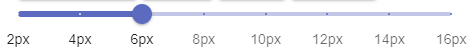

# Draw Between The Lines

## What Is It
-Draw Between The Lines is a front-end React based drawing application utilizing HTML5's Canvas. Built initially for the Mintbean hackathon, this project will continue on and grow with features and improvements.

## Who Made It
-Draw Between The Lines was made as a joint venture by [Mack Sawyer](https://github.com/macktsawyer) and [Richard Gonzalez](https://github.com/RichardGAnthology).

## Tech Used
- HTML5's Canvas, React.js, CSS/SASS MUI, React-Color, React-Icons, File-Saver

## Features

### Pencil Tool
- The pencil tool is a default of a round tipped 6px pencil which will draw as long as the left mouse button is clicked and dragged.

### Fill Tool
- The fill tool will fill the last shape drawn. If the shape isn't closed, the fill tool will close that path. Simply select the fill tool and click on the canvas.

### Clear
- The clear tool will completely clear the canvas. The undo button will recall in case of a mistake.

### Color Selector
- The color selector is a pop-up window that will allow the user to select a new color. When ready, click off once or click the button again. The button will display the currently active color.

### Line Width Slider
- The line width slider selector will allow users to change the width of the line they wish to draw with.

### Undo Last
- The undo last button allows users to undo the last mark made on their canvas.
 

### Save Image
- The save button in the very top right of the canvas will save the canvas as a .png image.

